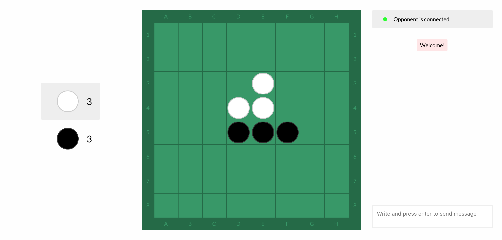

# js-othello
A nodejs/react othello/reversi game.

## How to run
Npm and node are required.

Run the game by issuing:

    $> npm run start

## How to play
Start the game by browsing to `localhost` and the chosen port (`8888` by default).
Click `Play`. The chat window will provide an invitation link that can be sent
to the opponent. The rules of the game are described [here](https://en.wikipedia.org/wiki/Reversi#Rules).

